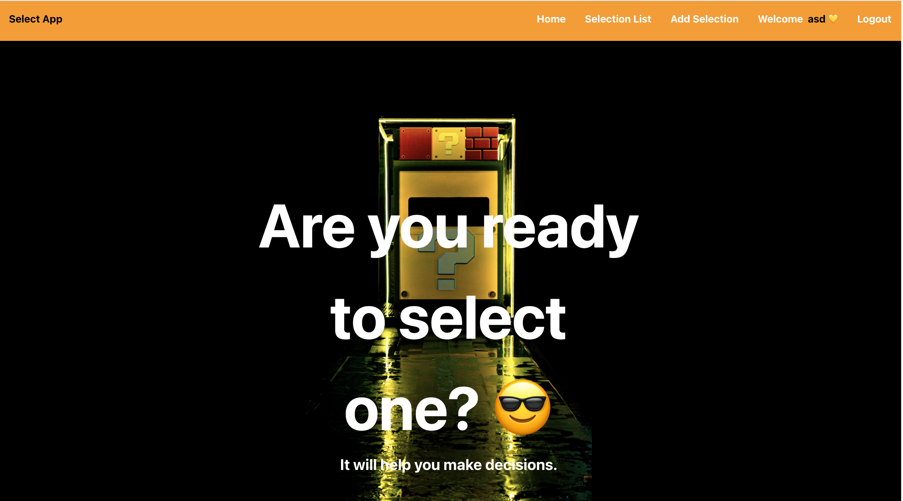
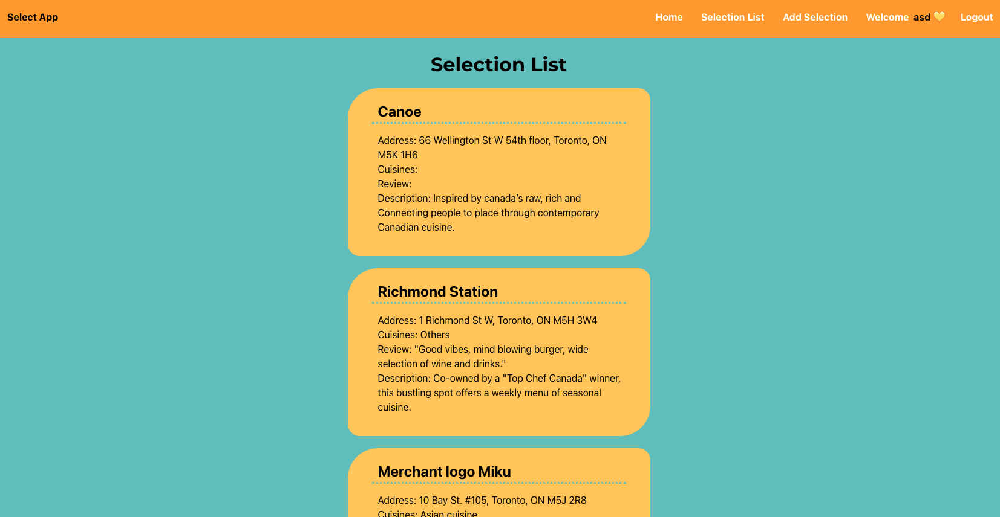
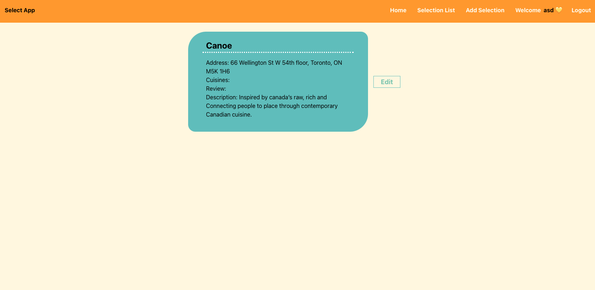
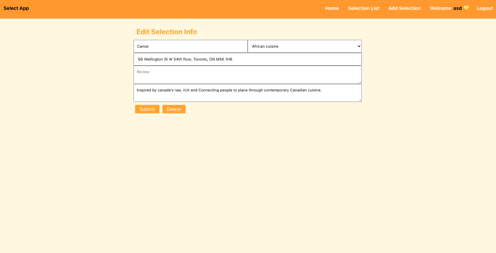
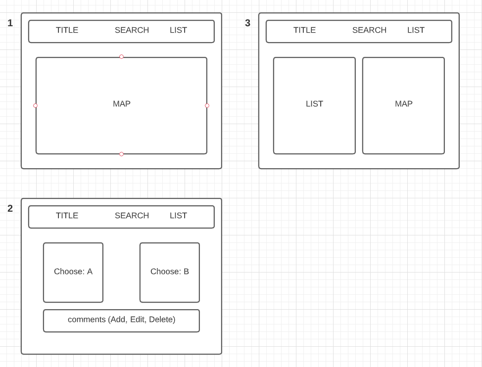
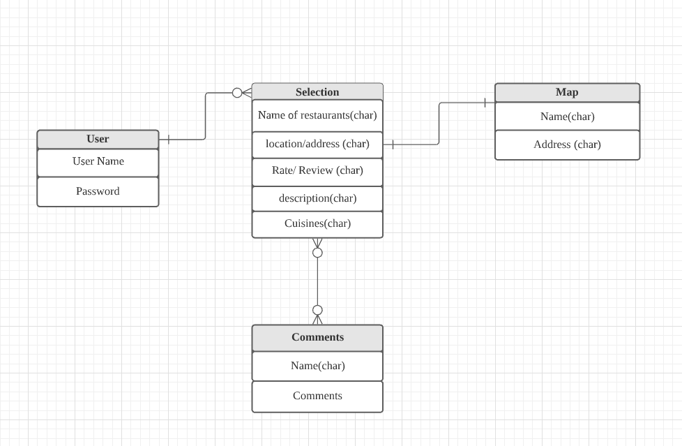

# App Title: Select App

The original idea of this app is to help you choose through voting.

In particular, it is sometimes difficult to make a decision when choosing a restaurant.

So this app helps you make decisions.

The more people there are, the more helpful it is.

## Screenshot(s):

## Technologies Used:

React, MongoDB/Mongoose, Express, Node, CSS, Heroku

## Getting Started:

Heroku: [Click]()

## Next Steps:

- Create two categories so that we can vote
- Using Map api and connect with selection's data
- create the token for individual user
